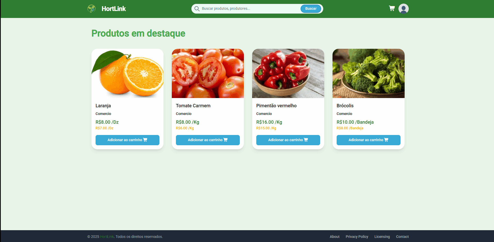
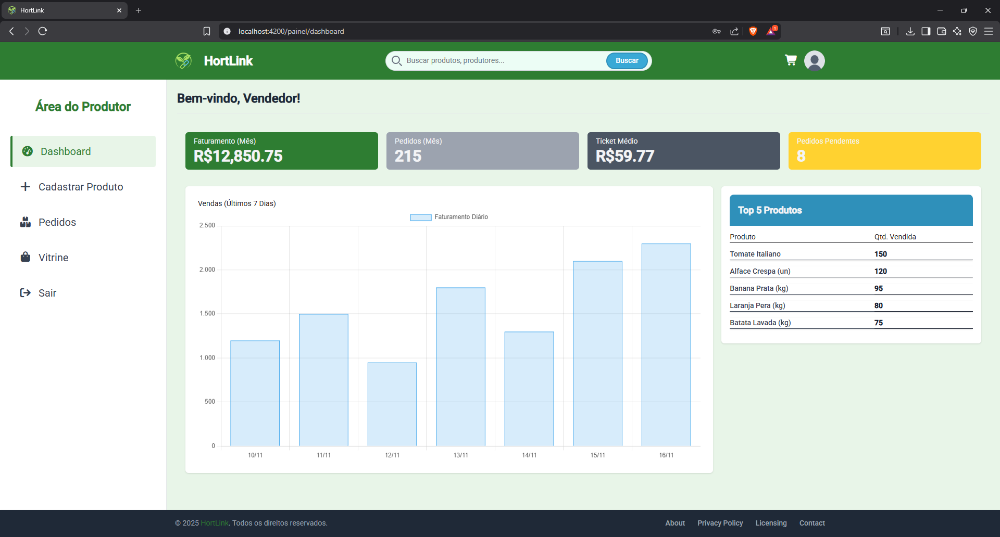
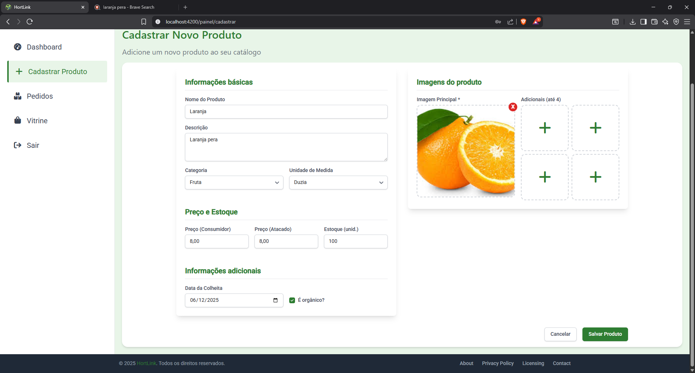

  
  
<strong>Conectando produtores rurais a consumidores e mini-mercados.</strong>

  

    <a href="#-sobre-o-projeto">Sobre</a> •
    <a href="#-tecnologias">Tecnologias</a> •
    <a href="#-funcionalidades">Funcionalidades</a> •
    <a href="#-demonstração">Demonstração</a>
  

  

    
    
    
    
    
    
    
  

---

## 🚀 Sobre o Projeto

O **HortiLink** é um marketplace digital inovador focado no setor de hortifrutis. O objetivo principal é conectar diretamente produtores rurais a mini-mercados e consumidores finais, visando reduzir o desperdício de alimentos e otimizar a cadeia de suprimentos através da tecnologia.

O sistema é composto por:
* **Back-end:** Gerencia regras de negócio, autenticação segura, persistência de dados e upload de imagens.
* **Front-end:** Interface intuitiva e responsiva para facilitar a navegação de vendedores e compradores.

🔗 **[Acessar Landing Page](https://edsss2.github.io/Landing-Page-HortiLInk/)**

---

## 🛠 Tecnologias Utilizadas

### Back-end
-   **Java 17+** & **Spring Boot 3**
-   **Spring Security + JWT**: Para autenticação e autorização robustas.
-   **JPA / Hibernate**: Para mapeamento objeto-relacional.
-   **H2 Database**: Banco de dados em memória para desenvolvimento.
-   **Swagger**: Documentação da API.

### Front-end
-   **Angular 16+**: Framework SPA.
-   **TypeScript**: Tipagem estática.
-   **TailwindCSS**: Estilização.

---

## 📦 Funcionalidades Principais

- [x] **Autenticação Segura:** Login e cadastro com validação via Token JWT.
- [x] **Catálogo de Produtos:** Listagem dinâmica com filtros por categoria.
- [x] **Gestão de Imagens:** Upload e armazenamento físico das fotos dos produtos.
- [x] **Dashboard do Vendedor:** Métricas de vendas e gestão de inventário.
- [x] **Carrinho de Compras:** Fluxo completo de seleção e checkout.
- [x] **Documentação API:** Interface Swagger interativa.

---

## 🎥 Demonstração do Sistema

### 🛒 Fluxo de Compra
> Demonstração do processo de escolha de produtos e finalização do pedido.

 

### 📊 Dashboard do Vendedor
> Visão geral com métricas e indicadores para o produtor.

 

### 🍎 Cadastro de Produto
> Interface para adicionar novos itens ao catálogo.

